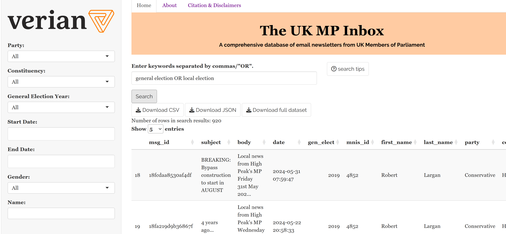
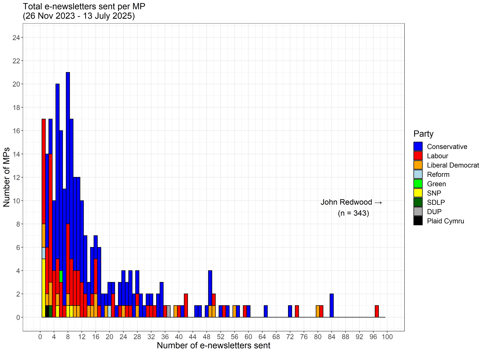
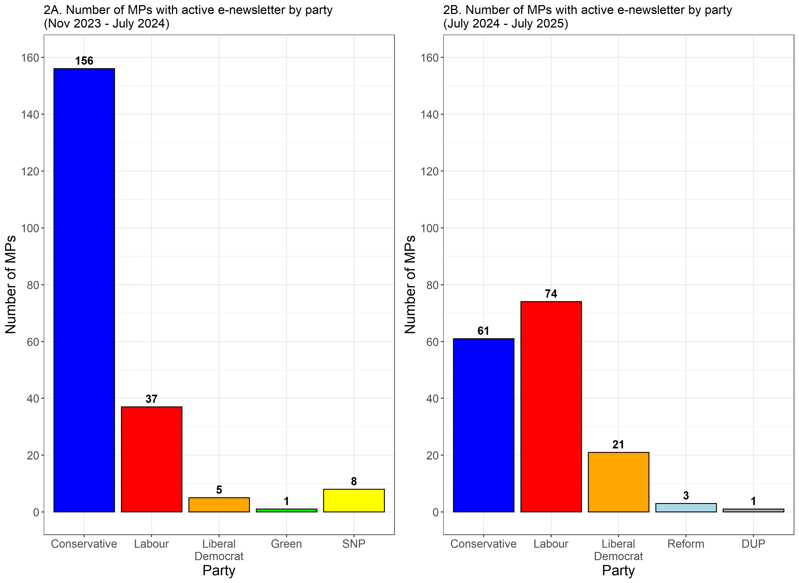
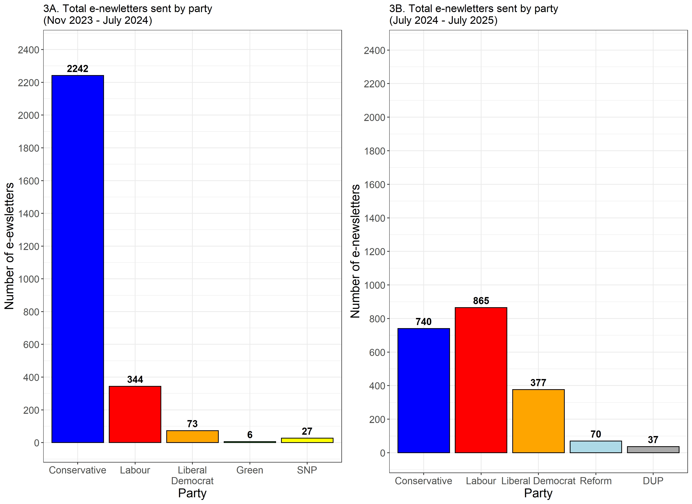
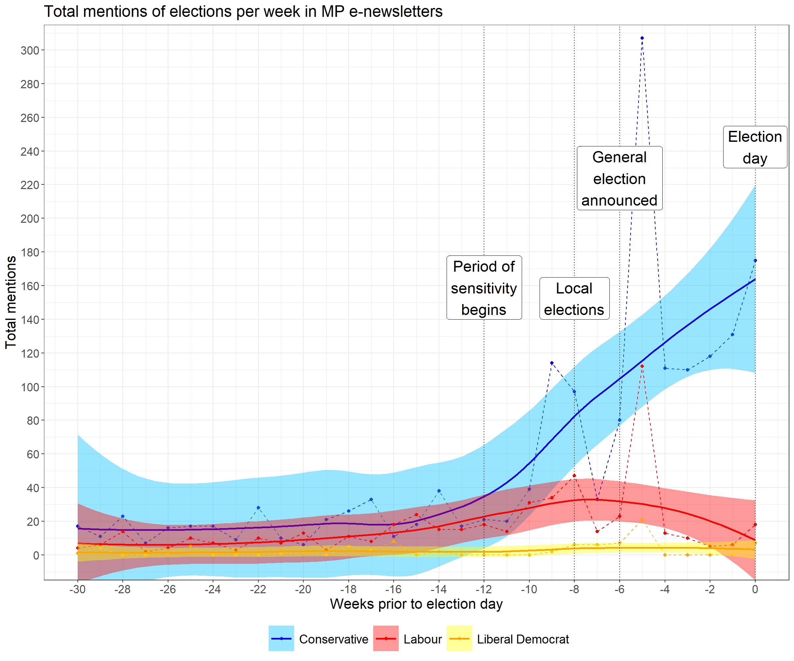

*Disclaimer: Any statements or opinions expressed in this blog are shared in a personal capacity. They do not reflect the official stances or policies of Verian.*

---

In autumn of 2023, I started building [**The UK MP Inbox**](https://ukmpinbox.shinyapps.io/uk_mp_inbox/) and quietly launched it after the 2024 UK General Election. Inspired by its American predecessor, [**The DC Inbox**](https://www.dcinbox.com/) (created by Dr. Lindsey Cormack), the UK MP Inbox is a consistently updated, publicly available database of official email newsletters sent by UK Members of Parliament. The goal is for these e-newsletters to be used in a wide variety of public sector and academic-oriented social science research, providing important insights into strategic political messaging, policy-making, and the relevant political zeitgeist.

For a time, I have been a bit reluctant to fully publicise the existence of the Inbox. Like many folks, I have been quite busy, and there is a series of features I would like to add to make it *perfect* before sending it out into the world. However, the perfect should not be the enemy of the good. So, by putting the Inbox into the world, I hope that it will simultaneously be a helpful source of data for researchers while forcing me to invest more time into updating the Inbox and writing fun blog posts like this one. With that in mind, please allow me to formally introduce [**The UK MP Inbox**](https://ukmpinbox.shinyapps.io/uk_mp_inbox/).

{width="90%"}

## Why build a database of e-newsletters?

From a social science and public policy perspective, e-newsletters allow MPs and their staffs to communicate more directly with their constituents than any other form of messaging. Most traditional public statements made by MPs are relayed through the media. As a result, public officials lack direct control over **if**, **when**, **how**, and **to whom** the message is reported among other competing messages and stories. While messaging through social media offers more direct control, communication is nonetheless subject to the whims of the website's algorithm and business incentives.[^1]

[^1]: This is particularly relevant as social media companies have increasingly deprioritised political and public policy news content on their platforms. For examples, see [Financial Times](https://www.ft.com/content/8ebb8854-426b-46f8-9c5c-b8f988c298f7), [NBC](https://www.nbcnews.com/tech/instagram-will-stop-recommending-political-content-rcna138178), and [Slate](https://slate.com/technology/2023/10/elon-musk-x-twitter-news-links-headlines-why.html).

In contrast, e-newsletters allow public officials to send direct, unfiltered messaging and information to the email inboxes of their desired audience: local constituents and potential voters that are likely highly politically engaged (they have self-selected into the audience, after all). As a result, e-newsletters allow MPs to reach their core audience and discuss the issues and topics that they most want their constituents to hear. Meanwhile, local constituents receive a free[^2] resource that allows them to interact directly with democratic representatives and stay informed about policies, issues, and events that impact their local communities just by signing up.

[^2]: Free insofar that signing up to receive a newsletter costs nothing. The e-newsletters themselves are penned using staff (i.e. under-appreciated interns) and resources paid for with taxpayer money.

By collecting these e-newsletters into one convenient database, social scientists can use them as data to better understand political communication strategies, key issues in local and national politics, political engagement, mobilisation, and other key aspects of democratic communication. Moreover, these data can be used in conjunction with public opinion data to add valuable context to polling trends and improve the breadth and depth of quantitative and qualitative insights.[^3]

[^3]: I, in my humble and completely unbiased opinion, highly recommend sourcing these polling data from Verian, an industry leader in public sector research in the UK and globally.

Beyond the policy and political research motivations, I am hopeful that the UK MP Inbox can be a good tool in a normative and democratic sense. What politicians say and how they use their time or resources is of public interest. There ought to be public records reflecting that. Like any other form of communication from public officials, e-newsletters influence public discourse on policy or electoral politics and are written using staff and resources funded with taxpayer money. While other forms of MP behaviour are dutifully documented by the government itself (e.g. MPs' expenses, voting records, and statements made in Parliament), there is no such comprehensive record of e-newsletters to date. While I am just one person doing this in their spare time, I believe that archiving this information for the public is an endeavour worth pursuing.

## How many MPs are consistently using e-newsletters?

As of writing (13 July, 2025), I have collected 4786 e-newsletters from MPs and their national parties, dating back to as early as 26 November 2023. Notably, the July 4th General Election throws a wrench into the works, as many MPs were understandably slow to set up their new offices. With that in mind, let us start with a snapshot of the seven months leading up to the general election instead.

Perhaps unsurprisingly, some MP offices appear to be more tech savvy than others, which is reflected in their e-newsletter usage. Prior to the 2024 General Election, just over 90% had a functioning website.[^4] A total of 400 (61.5%) had some form of e-newsletter sign up.[^5] From November 2023 to 13 May 2024, 209 MPs (32.2% of all MPs; 52.3% of MPs with e-newsletter sign ups) had sent at least one newsletter. So, while a healthy share of MPs do offer an e-newsletter service, the majority do not.

Interestingly, e-newsletter rates have dipped after the 2024 general election. From July 2024 to July 2025, only 161 MPs (24.8% of all MPs) have sent at least one e-newsletter. This phenomenon is possibly partially driven by the influx of brand new MPs, who likely lack the office infrastructure of the incumbents they replaced. However, it also correlates with the large loss of seats for the Conservative party, which I discuss in slightly more detail below. 

[^4]: Many of which were quite old and buggy.

[^5]: This includes instances where the sign up form/link exists but is either broken or leads to a 404 error. It does not include the three MPs that joined parliament via by-elections in early 2024. Though coincidentally, none of the out-going nor incoming MPs had e-newsletter sign ups.

{width="90%"}

**Figure 1** presents the distribution of total e-newsletters sent per MP from 26 November, 2023 to 13 May, 2024. The majority of MPs with active e-newsletters tend to send about one per month on average. These patterns are reflected in the rightward skew of this distribution, concentrating around one e-newsletter per month per MP (mean = 16.11; median = 9). A smaller share of MPs tend to send out e-newsletters on a roughly weekly or bi-weekly basis (for context, the time period here covers 85 weeks). A handful of MPs send out e-newsletters more frequently still. However, among all MPs, one serves as a true outlier: John Redwood (Wokingham, Conservative), who sends multiple updates per day, and is the undisputed king of e-newsletters despite stepping down prior to the 2024 General Election. 

This leads to an interesting question: why don't more MPs utilise e-newsletters? After all, maintaining an active e-newsletter is extremely low cost relative to other forms of communication. This fact does not appear to be lost on U.S. legislators, who make much more frequent use of e-newsletters. While this is a question worthy of some proper research, my gut instinct[^6] would have me highlight three potential suspects: 1) office staff funding and parliamentary expense rules, 2) party structure and incentives, and 3) a potential lack of perceived utility among the MPs (driven by a myriad of potential causes).

[^6]: Tired: careful scientific theory building and hypothesis testing. Inspired: some random guy's vibes-based conjecture.

## What trends do we see among the parties?

**Figure 2** presents a simple count of the number of MPs that have sent at least one newsletter, both prior to and after the 2024 general election.[^7] **Figure 3** presents the total number of e-newsletters sent by party over those same time periods. This quick look at some descriptive patterns makes one thing abundantly clear: Conservative MPs make much more frequent use of e-newsletters than Labour MPs.

{width="90%"}

Prior to the election, there were 4.2 times as many Conservative  MPs with active e-newsletters as Labour MPs. This partially an artifact of the size of the Conservative majority at the time. Yet, even when viewed as a proportion of each party, it is clear that Conservative MPs were far more likely to have an active e-newsletter on average. As a result, Conservatives sent over 6.5 times the number of newsletters as their Labour peers over this time period.[^8]

In substantial shift in the partisan make up of Parliament in the wake of the 2024 General Election yielded similar changes in e-newsletter rates. A large Labour majority in parliament translates only to a small plurality in the number of active e-newsletters and the number of e-newsletters sent. Yet, when viewed proportionally to the number of seats, the Conservatives still make much more frequent use of e-newsletters. Over 50% of all Conservative MPs in 2025 have sent at least one e-newsletter. Fewer than 20% of Labour MPs have an active e-newsletter by comparison.

{width="90%"}

[^7]: For parsimony, MPs who have lost the party whip have been grouped in with their relevant party (e.g. Diane Abbott would be counted under Labour). While Lee Anderson (who switched parties prior to July 2024), is counted under Conservative prior to the General Election and under Reform after his reelection.

[^8]: Even if we remove John Redwood as a clear outlier, the Conservatives have still sent 5.5 times as many e-newsletters as Labour.

Unsurprisingly, the smaller parties lag behind in raw numbers of MPs and total e-newsletters. Interestingly, recent electoral success does not necessarily translate into increased use of e-newsletters. While a larger number of Liberal Democrat MPs has resulted in more e-newsletters, Green Party MPs have not increased their e-newsletter output. While Reform UK and the DUP have increased their e-newsletter output since the election, a single MP with unique circumstances (Lee Anderson for Reform, Gavin Robinson for the DUP) makes up a disproportionate amount of that output.[^9]

[^9]: Lee Anderson accounts for 70% of all e-newsletters sent by Reform MPs. He was a frequent e-newsletter writer as a Conservative prior to joining Reform. Gavin Robinson serves as party leader for the DUP and accounts for 100% of the party's e-newsletters since July 2024.

For the smaller parties, these patterns may also be a function of party structure. Parties like the DUP, SDLP, and Sinn F&eacute;in take a much more centralised approach to communication in general. For example, Sinn F&eacute;in MPs have profiles on the party website rather than their own individual websites. 

To conclude, let us engage in a cheeky bit of quick election analysis just to demonstrate a potential use case. Also, elections are fun! 

While the following approach is pretty basic and would certainly benefit from some refinement, I hope that it nonetheless demonstrates the utility of these data. I downloaded every e-newsletter sent in the lead up to the 2024 General Election. I used a basic word search to flag every e-newsletter that used the term "election". **Figure 4** plots the number of times MPs used the term election over time, broken down by party. The dotted lines represent the total number of e-newsletters sent that week, while the solid lines represent the conditional mean trend line (with 95% confidence interval). 

{width="90%"}

These data reveal two major spikes in references to elections among the parties: immediately prior to the local elections and immediately after the announcement of the general election. From there, we can see quite a large divergence in party behaviour. Conservative MPs continue to make hundreds of mentions of the election every week in the lead up to election day. By contrast, discussion of the election among Labour MPs appears to drop down to pre-election levels after the initial spike in the wake of the announcement. Liberal Democrat MPs appear to exhibit a similar to their Labour peers. However, this is likely confounded by the fact that there were only five Lib Dem MPs with active e-newsletters at the time.

At the risk of once again straying a bit into conjecture, it is not too much of a stretch to say that these trends fit well within the prevailing narrative surrounding electoral incentives at the time: while Conservatives were frantically looking for messaging that would help them minimise electoral losses, Labour and the Liberal Democrats were content to avoid any controversies that might undermine their projected gains.

Unfortunately, this brief descriptive look does not allow for a good assessment of causality or broader context. Moreover, one should really do a deep dive into the text of these e-newsletters to get the full scope of the discussion (or lack thereof) occurring around the election among the parties. Nonetheless, I hope that even an incomplete analysis like this one shows that we can glean some pretty nifty insights from these data.[^10]

[^10]: Or at least provide some of us politics and policy nerds with some good entertainment.

## What is next?

There is much more to come from the UK MP Inbox in the near future. In regards to the Inbox itself, there are some key features that I would like to add to the website, including key descriptive statistics and data visualisations. If you have ideas for features that you would like to see added, please do not hesitate to reach out to me at [adam.ozer@veriangroup.com](mailto:adam.ozer@veriangroup.com). Maybe way down the line, I will considering using these e-newsletters to train chat bots for each party. That idea might be a bit silly, but maybe it would be interesting to see if *Tory bot* appears to be more or less ideologically conservative than the average Tory MP? Perhaps it would be interesting to see how *Labour bot's* tone shifts time as more emails are added to the proverbial pile?

In terms of research and writing, I hope to use this as a launchpad, motivating me to write regular blog posts about fun and interesting trends I see. I believe there is also a good amount of potential for some formal academic research. In particular, I would like to compare e-newsletter trends across countries, using additional data from the [**The DC Inbox**](https://www.dcinbox.com/), and the Australia-based [**CanberraInbox**](https://enewsletters.shinyapps.io/canberrainbox/) (recently launched by Dr. Daniel Casey). Even a quick eyeballing of the data already yields noticeable differences in usage rate and tone. For example, US legislators are far more likely to have an e-newsletter relative to their UK counterparts, likely due to better funding. Ultimately, these data are completely free to use for academic purposes. I would very much look forward to seeing any and all research applications that creative folks come up with.

Finally, perhaps I will send a cheeky email to Former MP John Redwood, the e-newsletter GOAT himself. Even Stephen King would blush at the prolific rate at which he writes. In fact, he is **still** writing e-newsletters at a blistering pace despite stepping down prior to the 2024 General Election. As someone who has seen a lot of e-newsletters, I can't help but be a little curious about what motivates him to keep writing so regularly. I am always looking for some good writing tips.

## A special thank you

I would like to give a quick thank you to both Lindsey Cormack and Daniel Casey. Their input and encouragement has been a big help in getting this passion project off the ground.
