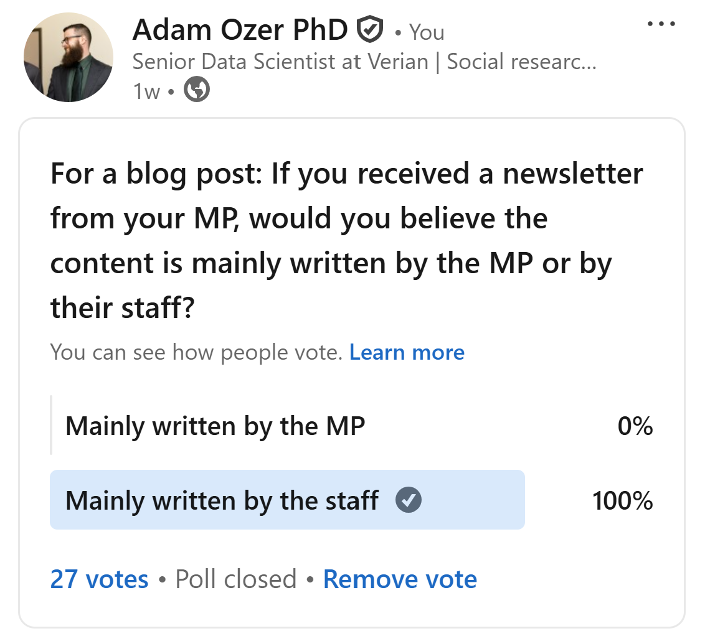

*Disclaimer: Any statements or opinions expressed in this blog are shared in a personal capacity. They do not reflect the official stances or policies of Verian.*

[**Click here to access The UK MP Inbox e-newsletter database**](https://ukmpinbox.shinyapps.io/uk_mp_inbox/)

---

Since launching the [**The UK MP Inbox**](https://ukmpinbox.shinyapps.io/uk_mp_inbox/), I have had a few colleagues ask me if I had plans to reach out to any legislators and ask them about their experiences communicating with constituents through email newsletters. While the thought had crossed my mind, I would be lying if I claimed I was well and truly planning on trying to contact a legislator to pester them with questions for this little project. 

However, I did not anticipate that a former legislator would reach out to me. I received an email from [Richard Corbett](https://richardcorbett.org.uk/), former Member of European Parliament (Yorkshire and the Humber) and Leader of the European Parliamentary Labour Party (EPLP). He let me know that he had read my original blog post[^1] and wanted to share some of his constituency newsletters from his time in office. After exchanging a few emails, he kindly agreed to sit down for a chat and answer my questions about fostering healthy communication with constituents and the process of producing e-newsletters. While I am certainly no formally trained journalist, I want to try to share some of the interesting excerpts and insights from that discussion.

So, how do newsletters fit into politicians' overall communication strategy? How do politicians determine the content to include and what issues to discuss? Do politicians *really* write their own newsletters or do they just have their staffers write them for them? Why don't more MPs have newsletters? What does the future of newsletters, and other long form informational content, look like in a world that is increasingly dominated by short form content? MEP Richard Corbett lends us his perspective from the other side of the email inbox.

[^1]: Which frankly baffles me. I can't even get my parents to read the damn thing.

# Why write constituent newsletters?

A reoccurring theme throughout our conversation was how geography and the size of a constituency can have a profound impact on communication. Large populations and shifts in district maps can create logistical problems for any legislators' communication strategy. However, this challenge was exacerbated for MEPs, who represented geographic areas that spanned across several parliamentary constituencies. Overcoming this challenge required Mr. Corbett to cast a wide net with distribution while also coordinating with other local actors to proliferate the message.

::: {.blockquote}
> Me (AO): "Why did you start writing newsletters to your constitutents?"
>
> Richard Corbett (RC): "Why did I start doing a newsletter? Well, as a member of the European Parliament, I had quite a large constituency initially. [Originally] It was the single member constituencies, but even those are eight Westminster constituencies grouped together. So eight times the size of of what most people in the UK are used to. Then, when we switched to proportional representation by region, the regional constituencies were even larger. So to communicate with a very large number of people, I tried a number of methods, one of which was the newsletter, which would go out to all Labour Party members in the in the area and local council leaders. I think we sent it to libraries, newspaper journalists that we knew, and then anybody basically who we wanted to be signed up to the mailing list."
>
:::

While newsletters were an effective tool, Mr. Corbett explained how they were one piece of a larger cohesive strategy to engage with constituents. 

::: {.blockquote}
> RC: "It wasn't the only tool I had. Like all Members, at the end of the week in your constituency office, you make it known that you're available to meet people. You deal with people by e-mail. I had a very comprehensive website which dealt with a lot of issues as they came up: giving explanations of what this issue was, how it works, and what position I had taken. I would tour around a lot on Fridays, Saturdays and Sundays. When you're back in the constituency, you're speaking in different places across the region. That may sometimes be talking to 10 people in a room. It may be to a couple of hundred. But over time that adds up."
> 
> AO: "What advantages or disadvantages do you see e-newsletters playing in your arsenal of communication tools?"
>
> RC: "Well, you you say "e-" newsletter. It was also printed, especially in the early days. So it was both the written version and an "E" version and [they are both] a reporting back mechanism."
:::

A "reporting back mechanism" is a particularly elegant phrase which sums up his view on the purpose of newsletters, and constituent communications in general. His approach to communication came across as rather matter-of-fact, implying that newsletters were more an informational tool than one meant for persuasion of public opinion or election campaigning. His focus remained primarily on the details, highlighting a specific issue or event, the course of action he intended to take, and the justification for that decision. From the way Mr. Corbett described it, even electoral politics were framed with that facts-oriented informational angle.  

::: {.blockquote}
> RC: "This was what I've done on your behalf. Yeah, you've elected me, this is what I've been doing. These are the positions I've taken. It's the sort of visibility thing: "Hey, you know there's another election coming up?" Every five years, there's the selection of people who will be the Labour Party candidates, and that normally entailed a vote of all party members in the constituency. So for them to see that I'm active, I'm transparent, and I report back so [consitutents] get a flavour of what I do was also very important."
>
:::

# Balancing content and encouraging engagement

As someone who has read way too many e-newsletters, I had imagined that MPs must struggle to determine what issues or events to cover in a newsletter. I was quite keen to hear about various strategies for juggling multiple issues. While there are so many topics to cover, space in a newsletter is very limited. Also, there are only so many newsletters one can send before recipients start to view it as spam. However, Mr. Corbett described the process as far more organic and contextual than strategic. While a good deal of thought clearly went into what content to cover, the main priority was clarity and relevance to the reader. Moreover, in his position as MEP, he was typically a bit reluctant to step on the toes of his colleagues in UK parliament.

::: {.blockquote}
> AO: "How do you balance the content of those newsletters? Issues, events, calls to action, all the things that go into it?"
>
> RC: "I guess that would fluctuate according to events over time, particularly because it was a quarterly report. So for that particular quarter, what had been the big issues? What had I been doing? Of course, in a report, you want it to be readable and reasonably varied. So you try and get a balance of different things that would be of interest to people. Some things are of interest to some people, other things of interest to other people. So you try and have a variety of things in there. But it's mostly governed by what you've been doing in that period."
>
> AO: "Given that there's so much going on constantly, and especially in your position [as an MEP] where there are local, national issues, and international issues, how do you balance which issues you choose generally?"
>
> RC: "It depends what's been happening, what's been in the news, and what I've been doing. But I would probably give a greater emphasis to European level issues because that was my role. I was a member of the European Parliament, so I would not get too stuck into Westminster controversies. I can leave that to my Westminster colleagues, but I would be focused on what was happening at European level."
:::

In addition to varied content, Mr. Corbett also emphasised the need to encourage feedback from constituents. An underlying goal was to funnel readers from the newsletter to his contact information, allowing them to get in touch. This would allow him to get a better assessment of public concerns, generate opportunities for more direct communication, and offer hands-on help to constituents in need.

::: {.blockquote}
> RC: "The newsletters generated feedback. Of course, how to contact me was he was on the newsletter. [They contacted me] normally be by e-mail, or sometimes by telephone, wanting to come and see me. But e-mail would be the most common. They were usually either writing to agree or disagree with something, or to ask for further information, or to get help with queries, or to send invitations to come and speak to them, to different groups and whatever."
>
> AO: "Any particular stories stand out?"
>
> RC: "Oh, gosh, that's so long ago now. It clearly follows what was in the news to a degree. The subjects that attracted a lot of attention were things like the euro: when it went into a difficult period and the whole debate on whether Britain should join the euro. Sometimes people contact you about things that are European, but not in the sense of what the European Union has done. You get constituents writing to you saying 'I had a car crash in Italy last summer. There's a problem with the insurance that's not been sorted out. Can you help? What do I do? Who do I contact in Italy?' Or 'I worked in Denmark for three years. My Social Security contributions that I paid there was supposed to be refunded into the UK system. There's a hold up in the Danish ministry. Can you help me?' And often you could help, with your contacts and your colleagues from those countries in the European Union. So emails and messages from constituents are not always generated by [the content of the newsletter]. But it's a way of saying, 'hey, I'm here'. So maybe on a completely different subject, you get people writing to you on major political issues or on personal issues like that."
:::

# Yes, the words are actually his own

Mr. Corbett assured me that the vast majority of words in each of his newsletters were authentically his. He chose the topics and either wrote or dictated the newsletters himself. To be fair, there were smaller tasks and little flairs that would require help from his staff. Most of these are things one would likely forgive a legislator for delegating to a tech savvy staffer, This included formatting emails, programming his website, or compiling lists of relevant external resources.[^2] Still, he would thoroughly review any material before it was published. Ultimately, he took no shortcuts. If it had his name on it, he had a direct hand in creating it. 

[^2]: Come to think of it, maybe I should have offered to teach him how to use Quarto and GitHub to launch his own blog? Cut out his IT staffer entirely and do all the programming himself? Richard, if you are reading this footnote and want to waste time learning to become an unimpressively competent R user like me, shoot me an email.

::: {.blockquote}
> AO: "When it comes to actually writing the newsletters, how much of it was your own personal input versus a staffer's?
> 
> RC: "For the content, it was largely me. I used to have a little dictaphone and I would dictate while I'm travelling or whatever, and it would be then typed up. I may ask one of my staff to produce a draft with all the formatting and photos, put it up [on the website], send it out [via email]. 
>
> AO: "Are there any personal flares that you generally add to the messaging to get through to your audience that it is you?"
>
> RC: "I hope that it was clear from the way it read that it's genuinely from me.
"
:::

Of course, this is just a sample size of one, other politicians may not be so hands on with their messaging. But Mr. Corbett was appalled by the idea of any politician delegating their own words to a staffer. While he gave a brief wry chuckle at the idea of using an AI chatbot, he highlighted that careful word choices matter quite a bit in politics. It is not only a matter of authenticity and accessibility, but also a simple matter of pragmatism and risk.

::: {.blockquote}
> AO: "I might be putting words in some people's mouths, but I think many people would be surprised to hear that most of the words in the newsletters are actually your own and not just some random staffer. Do you think most politicians use thier own words rather than delegate [newsletter writing] to a staffer?
> 
> RC: "Well, they should, because politicians need to be very careful about which words they choose. I mean the wrong word here or there can land you in a lot of political difficulty if you're not careful. You're trying to express your own views after all, and communicate it to a lot of people. It should be your own - your own views, I mean. I'm not saying there aren't parts [that staffers help with]. Like at the back of each constituency report, I put a list of all the meetings I've been to and places I've been, just as a reporting thing. I got a member of my staff to do that. But then I would read it over, of course, to check that there were no mistakes." 
>
> AO: "I think a lot of people might just assume that any political messages put out by a politician's office are written by either a staffer or artificial intelligence."
>
> RC: "Any elected representative who doesn't at least check it over very carefully and adjust the wording is being silly... But yeah, I guess nowadays I could get AI to write it."
>
:::

As a brief aside, after our chat, I was left wondering whether or not my gut feeling was correct. Do people generally assume that legislators do not write their own newsletter? To test this, I employed only the most rigorous scientific methodology: I put up a quick poll on social media. My massive sample of 27 social research and data science nerds is, of course, incredibly robust and unimpeachably perfect in its representativeness and generalisability. Jokes aside, it became pretty clear that folks were generally as cynical as I had anticipated. 

{width="60%"}

Unfortunately, I did not have the foresight to run my brilliant scientific study prior to my chat with Mr. Corbett. Nonetheless, I did manage to ask him about public cynicism and if he believed he can convince his constituents that it's really him writing the newsletter. He felt that his personal voice came through in his writing, and he hoped that would be enough to indicate to readers that it was genuinely him. But at the end of the day, even if readers incorrectly assume a staffer wrote it, so long as his constituents found the content useful and informative, he would be able to take satisfaction in knowing he did his job.

::: {.blockquote}
> AO: Do you feel that there are ways to try to cut through that potential for cynicism amongst the public? Or is it simply a matter of just speaking your truth and hoping it finds home?
>
> RC: "I think we live in an age of cynicism, I suppose. But you can do things right and clearly. It's more about what the content is. Is it saying something useful? Interesting? Explanatory? Informative? Then people focus more on what it says rather than 'I wonder if he got his assistant to draft this for him' or 'did he write it directly himself'. They should, in any case, know that the final product is me, because if you ask somebody to write something, you've got to damn well check it and adjust it."
:::

# Why don't more MPs use e-newsletters?

Mr. Corbett was both fascinated and surprised by the fact that the majority of MPs do not have an active e-newsletter. He took a particular interest in how these numbers broke down by party. He also offered an initial hypothesis for why Conservative MPs are writing newsletters at much higher rates than Labour MPs: the day-to-day operations for the majority party are more demanding, perhaps leaving MPs with less time and resources to write e-newsletters. However, it is not only a good theory, but a very testable one.[^3] In the future, if I write an analysis assessing the quantity and content of e-newsletters as MPs shift from opposition to majority (or vice-versa), you will know from where I ~~blatantly stole~~ borrowed the idea.

[^3]: Of course, that did not stop my old academic buzzkill instincts from kicking in and prodding at a totally sensible hypothesis. 

::: {.blockquote}
> AO: Speaking strictly about MPS rather than MEPs, only about 1/3 of UK MPs have an active e-newsletter.
>
> RC: "That's astonishing. Did you say earlier there's a difference by party on this?"
>
> AO: "Yes, actually. I guess we'll just stick with post-election numbers for the moment. About half of all Conservative MPs have an active E newsletter, whereas only about 1/5 of Labour MPs have an active E newsletter.
>
> RC: Wow.
>
> AO: Yeah. So I guess based on both of those facts, are you surprised by those numbers at all?
>
> RC: Yes, I would have thought Labour MPs would be more diligent, shall we say. I suppose that as one explanation, you could correlate your figures from before and after the election. So a hypothesis: Is it because Labour is in government, so they're far bit busier? Many of them are ministers or junior ministers or have other roles, so they're much more busy in Westminster. Whereas if you're in opposition, you've got a lot of time on your hands. So you can spend more time writing newsletters, I don't know? Do your figures from before the '24 switch show it the other way round, and Labour had more newsletters than the Conservatives?
>
> AO: Interestingly, no. The numbers are a little bit better because the denominator changes. There are fewer Labour MPs before the election than after. But for the most part, Conservative MPs tend to write far more newsletters.
>
> RC: Wow, interesting.
:::

Despite the initial surprise, he was also highly sympathetic towards his Westminster colleagues. He suggested that MPs have many local and contextual factors to consider in their communication strategies. He personally found newsletters to be a useful tool. However, he suggested that some MPs may simply be prioritising other, more direct forms of constituency communication approaches. As such, a lack of a newsletter may reflect the logistics and contexts an MP must navigate rather than a breakdown in constituency communication.

::: {.blockquote}
> AO: "Why do you think more MPs, from either party, don't leverage newsletters more as part of their communication approach? Do you think they're missing out on something either strategically or normatively?"
>
> RC: Yeah, well, that's hard to tell. I mean, of course, MPs have smaller constituencies than I had. So they can often rely on direct contact with people and local newspapers, which are now of declining importance, but used to be quite significant. An MP might get into the local newspaper more easily for his or her area, which was more difficult for a member of the European Parliament, covering a much wider area. And also local radio stations. So MPs may rely much more on that.
>
> AO: "Do you think more MPs should be taking advantage of newsletters and e-newsletters?"
>
> RC: "Well, I certainly found it to be useful in my situation. For MPs, it's up for them to judge what will be useful in their situation. [There is] another factor of having a smaller constituency, a Westminster sized constituency, especially if it corresponds to a particular town or whatever. The MP would regularly be invited to local events: the opening of new markets or ceremonies commemorating the end of the Second World War or whatever it might be. There are always civic events where the MP would be on the list. They can go there and meet lots of people, be visible, and generate discussions about this or that. Maybe subsequent correspondence for a Member of the European Parliament - with multiple localities across a wider area - was a less reliable way of being out and about, being visible, talking to people, and bumping into people."

:::

For the most part, our conversation was relatively non-partisan, orbiting mostly around on the day-to-day of constituent communications than party strategy or rhetoric. However, I couldn't pass up the opportunity to ask why he thinks Labour MPs write newsletters far less than their Conservative counterparts. In truth, we spent more time discussing specific e-newsletter numbers for the larger political parties (i.e. Labour, Conservatives, Liberal Democrats, Greens, and Reform) and notable outlier cases (e.g. Lee Anderson switching parties prior to the general election). Yet, beyond his initial majority versus opposition hypothesis, Mr. Corbett did not indicate that he felt there were any inherent qualities unique to one specific party that explains the gap in e-newsletters. Nonetheless, as demonstrated in the excerpt below, his message to his Labour colleagues was simple: write more e-newsletters, lest they be out-hustled by their Conservative rivals.

::: {.blockquote}
> AO: "Why do you think conservatives are are taking advantage of [e-newsletters] at a higher rate than the Labour Party?"
>
> RC: "Well, I don't know. I put out a hypothesis earlier that it was because we're in government, and when you're in opposition, you've got more time to do these things. But then you said before the election, it wasn't so different, so I don't know."
> 
> AO: "Interestingly, some colleagues in both America and Australia are doing similar projects, and they found a very similar pattern where the more right wing parties tend to write more newsletters than the left wing parties. Do you reckon there's any sort of kind of strategic or ideological reason for that pattern?"
>
> RC: "Well, you're the researcher. This is for you to find out."
>
> AO: "Ha, fair point. If you were to basically send a message to all your Labour colleagues about the gap in newsletters, what would you tell them?
>
> RC: "All I'd say is that I'd raise the alarm. The Tories do are doing this much more than we are, so get out and do it!

:::

# What role do e-newsletters play in a changing media landscape?

In my original blog post, I noted that politicians were not always the most tech savvy bunch, at least based on my personal experience visiting hundreds of MP websites. However, changes in technology have not been lost on most politicians. Reflecting on his time in office, Mr. Corbett noted how rapidly the landscape has shifted from long form content to short form messaging and posting. He noted that the public is bombarded with constant messages, undermining people's attention spans. As a result, many MPs may be incentivised to shift effort towards quick fire social media posts and away from longer, but more thoughtful e-newsletters.

::: {.blockquote}

> RC: "It's over five years now since I ceased to be an MEP, but even towards the end of my term of office, I think the media landscape and the communications landscape was changing. There are new tools to communicate online. Things a lot of [MPs] may be doing now may be sent as short messaging. 'Hi, I'm here. I've just been doing this. Blah blah blah' and send it out by these new methods. So a written or electronic newsletter is perhaps seen as relatively declining importance as these new ways of communicating electronically have have risen."
> 
> AO: "Do you feel that something is being lost if we were to move away from newsletters and that sort of long form messaging?"
>
> RC: "Well, yes, it's a general pattern with this not just with regards to MPs or MEPs or newsletters. People are shifting to short, sharp messages: 'Look at this! Hey, look at this!' instead of a longer, considered piece. Newspapers have declined. Messages posted on X or its equivalents, which are always very short, have increased. I gather there's studies that have shown that people's attention spans are now much shorter than they were even 10 years ago, because there's so many things flashing up very quickly, with much less time to read and consider something at length."

:::

What can politicians do in light of these rapid technological changes? Mr. Corbett suggested that it is not a binary choice between delivering informative long form content, like e-newsletters, and reaching audiences through effective short form messaging. Instead, clever politicians can meet their audiences half way by gathering communities online and guiding them to useful long form content, like newsletters and reports. He highlighted MP Anna Dixon (Shipley, Labour) and her use of *WhatsApp* as a prime example of using effective outreach to engage her constituents and funnel them towards content that will keep them informed.

::: {.blockquote}
> AO: Do you feel it's important to try and improve attention spans and kind of build better communication practises? Or is it more a matter of navigating the environment that you find yourselves in?"
>
> RC: You always try to navigate the environment you find yourselves in. I suppose the trick will be to use short chat messages to link to something that hopefully people can reflect on or read at greater length. I just thought of something like that off the top of my head: my local MP here in Shipley. I get reports from her via WhatsApp because she's built up a very large WhatsApp group of people and [the messages] go out that way. So there are different ways of doing it nowadays.

:::

# The most pressing intellectual questions of our time

Finally, after a fascinating and informative conversation, I felt it was only right to conclude with heated intellectual debate on a hot button culture war topic.

::: {.blockquote}
> AO: "My final question. I couldn't pass up the opportunity to ask you a really silly one. If you have two lasagnas and you stack one on top of the other, do you have two lasagnas or one giant lasagna?"
>
> RC: "It's a question of definition, isn't it? But it depends if they're identical in their contents. Lasagnas can vary and different recipes. If you've put 2 different recipes, one on top of the other, I think you could probably still distinguish them and say these are two different lasagnas. If it's the same recipe and you just put one on top of the other. You can call it one lasagna.
>
> AO: "Interesting, so a debate about a quality, not quantity?
>
> RC: "Yes." 

:::

Is the debate now settled? I will leave that up to the reader to decide.

## Acknowledgments {.appendix}

Preview image by [Michael D Beckwith](https://unsplash.com/@mdbeckwith) on [Unsplash](https://unsplash.com/photos/big-ben-and-the-houses-of-parliament-at-dusk-soN9dynO5fo).

